 *Universidad Privada de Tacna - Escuela Profesional de Ing. de Sistemas*

“Año del Bicentenario, de la consolidación de nuestra Independencia, y de la conmemoración de las heroicas batallas de Junín y Ayacucho”

**FACULTAD DE INGENIERÍA**

**ESCUELA PROFESIONAL DE INGENIERÍA DE SISTEMAS**

**“Sistema de Asistencia de Investigación Integrado con Zotero y Herramientas de Inteligencia Artificial”**

**Integrantes:**

|**Nº**|**Código Universitario**|**Apellidos y Nombres**|
| - | - | - |
|**1.-**|**2024080298**|**García Cham, Roberto Antonio**|
|**2.-**|**2017057528**|**Ccalli Chata Joel Robert**|
|**3.-**|**2017057888**|**Casilla Maquera, Tell Ivan**|

**CURSO : “Inteligencia Artificial”**

**SECCIÓN : “A”**

**DOCENTE : Dr. “Oscar J. Jimenez Flores”**

**Tacna - Perú 2024**

**Sistema de Asistencia de Investigación Integrado con Zotero y Herramientas de Inteligencia Artificial**

**Informe de SRS - FD03**

|CONTROL DE VERSIONES||||||
| - | :- | :- | :- | :- | :- |
|Versión|Hecha por|Revisada por|Aprobada por|Fecha|Motivo|
|1\.0|Joel Ccalli Roberto García Tell Casilla|Joel Ccalli Roberto García Tell Casilla|Roberto García|19/05/2024|Versión inicial|

**ÍNDICE GENERAL**

INTRODUCCION.................................................................................................................................4

1. Generalidades de la Empresa..........................................................................................................5
1. Nombre de la Empresa........................................................................................................5
2. Vision...................................................................................................................................5
2. Mision.................................................................................................................................. 5
2. Organigrama........................................................................................................................5
2. Visionamiento de la Empresa..........................................................................................................5
1. Descripcion del Problema....................................................................................................5
1. Objetivos de Negocios.........................................................................................................5
1. Objetivos de Diseño............................................................................................................ 5
1. Alcance del proyecto........................................................................................................... 5
1. Viabilidad del Sistema......................................................................................................... 5
1. Informacion obtenida del Levantamiento de Informacion....................................................6
3. Análisis de Procesos.....................................................................................................................6
1) Diagrama del Proceso Actual – Diagrama de actividades..................................................6
1) Diagrama del Proceso Propuesto – Diagrama de actividades Inicial..................................7

IV Especificacion de Requerimientos de Software..............................................................................7

1) Cuadro de Requerimientos funcionales Inicial....................................................................7
1) Cuadro de Requerimientos No funcionales.........................................................................7
1) Cuadro de Requerimientos funcionales Final......................................................................8
1) Reglas de Negocio..............................................................................................................9

V Fase de Desarrollo.........................................................................................................................12

1. Perfiles de Usuario............................................................................................................ 12
1. Modelo Conceptual..............................................................................................................5
1) Diagrama de Paquetes........................................................................................................5
2) Diagrama de Casos de Uso.............................................................................................. 12
2) Escenarios de Caso de Uso (narrativa).............................................................................14
3. Modelo Logico.......................................................................................................................23
1) Analisis de Objetos............................................................................................................23
1) Diagrama de Actividades con objetos...............................................................................32
1) Diagrama de Secuencia.................................................................................................... 37
4) Diagrama de Clases..........................................................................................................42

CONCLUSIONES..............................................................................................................................46 RECOMENDACIONES..................................................................................................................... 46 BIBLIOGRAFIA..................................................................................................................................46

WEBGRAFIA.....................................................................................................................................46

1. Generalidades de la empresa
1) Nombre de la empresa UpSystem Solutions
1) Visión

   Ser reconocidos como líderes en el desarrollo de soluciones tecnológicas innovadoras que impulsen la investigación académica y científica a nivel mundial, contribuyendo al avance del conocimiento y al bienestar de la sociedad.

3) Misión

   Nuestra misión es desarrollar un sistema integral de asistencia a la investigación que integre Zotero con tecnologías de inteligencia artificial, proporcionando a los investigadores herramientas avanzadas para gestionar referencias bibliográficas, analizar literatura científica y colaborar de manera efectiva, con el fin de mejorar la eficiencia y productividad en el proceso de investigación.

4) Organigrama

   

2. Visionamiento de la empresa
1) Descripción del problema

   El proyecto aborda los desafíos que enfrentan los investigadores en la gestión eficiente de referencias bibliográficas, el análisis de grandes volúmenes de literatura científica y la colaboración en equipo. La falta de herramientas avanzadas y plataformas integradas limita la productividad y eficiencia en el proceso de investigación.

2) Objetivos de negocio

   Posicionarnos como líderes en el mercado de soluciones tecnológicas para investigación académica y científica, ofreciendo productos innovadores y de alta calidad que satisfagan las necesidades y expectativas de nuestros clientes.

3) Objetivos de Diseño

   Desarrollar una plataforma integral que integre Zotero con tecnologías de inteligencia artificial, proporcionando asistencia avanzada en la gestión de referencias bibliográficas, análisis de literatura científica y colaboración entre investigadores.

4) Alcance del proyecto El proyecto incluye el desarrollo, implementación y despliegue de un sistema de asistencia a la investigación que integra Zotero con herramientas de inteligencia artificial, proporcionando funcionalidades avanzadas para la gestión de referencias, análisis de textos y colaboración entre investigadores.
4) Viabilidad del sistema
- Tras evaluar los requisitos técnicos del sistema propuesto, hemos determinado que la tecnología actual es capaz de soportar el sistema. Sin embargo, se necesitarán algunas actualizaciones y adquisiciones para garantizar un funcionamiento óptimo.
- En la evaluación de la factibilidad económica, hemos detallado todos los gastos asociados con el proyecto. Esto incluye los costos de desarrollo, implementación, ambiente y cualquier otro costo relevante.
- La integración del sistema propuesto en las operaciones existentes será un desafío, pero es factible. Se necesitará formación y apoyo para garantizar que el personal pueda utilizar eficazmente el nuevo sistema.
- El sistema propuesto cumple con todas las leyes y regulaciones aplicables. Sin embargo, se deberá realizar un seguimiento continuo para garantizar el cumplimiento a medida que cambian las leyes y regulaciones.
- Aunque el sistema propuesto tendrá un impacto significativo en las personas dentro y fuera de la organización, creemos que este impacto será en su mayoría positivo. Se necesitará una comunicación efectiva para gestionar este cambio.
- El sistema propuesto tendrá un impacto mínimo en el medio ambiente. Se tomarán medidas para minimizar aún más este impacto siempre que sea posible.
- Tras analizar el Valor Actual Neto (VAN), la Tasa Interna de Retorno (TIR) y el cociente Beneficio/Costo (B/C) de nuestro proyecto, podemos concluir lo siguiente:
- La relación Beneficio/Costo (B/C) es un indicador importante para evaluar la rentabilidad de un proyecto. En este caso, el B/C es 2.059, lo que significa que por cada unidad invertida, se espera obtener un beneficio de 2.059 unidades. Esta relación es mayor que 1, lo que indica que el proyecto es financieramente viable.
- El Valor Actual Neto (VAN) es una medida fundamental que indica si un proyecto generará un valor económico positivo o negativo a lo largo de su vida útil. Con un VAN de 5843.250, se concluye que el proyecto tiene un valor económico positivo. Esto significa que, en términos actuales, el proyecto generará un beneficio neto de 5843.250 unidades monetarias.
- La Tasa Interna de Retorno (TIR) es otro indicador crucial que mide la rentabilidad de un proyecto. Con una TIR del 96%, podemos concluir que el proyecto tiene una tasa de retorno muy sólida. Una TIR del 96% supera claramente las tasas de interés alternativas, lo que sugiere que el proyecto es atractivo desde el punto de vista financiero.
6) Información obtenida del levantamiento de información
3. Análisis de procesos

   a) Diagrama de procesos Actual – Diagrama de actividades

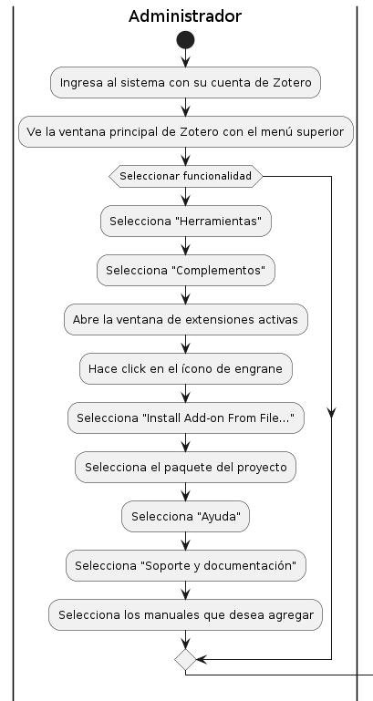

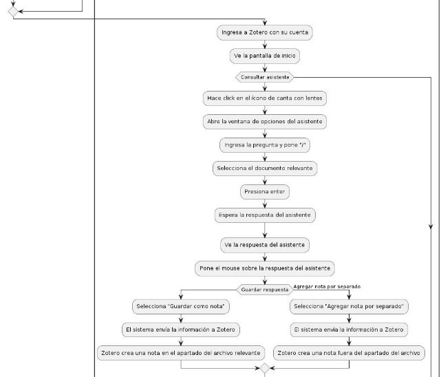

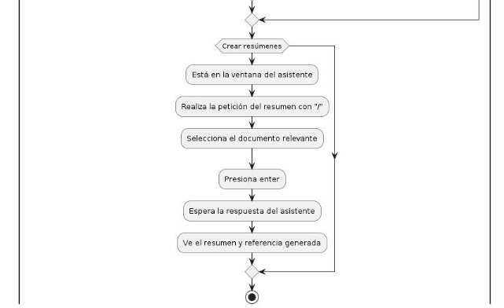

4. Especificación de requerimientos de software
1) Cuadro de requerimientos funcionales Inicial

|Código|Requerimiento Funcional Inicial|
| - | - |
|RFI 01|Registro de usuarios: Los usuarios deben poder crear cuentas y recuperar contraseñas de forma segura.|
|RFI 02|Gestión de referencias bibliográficas: Los usuarios pueden agregar, editar y eliminar referencias con campos detallados.|
|RFI 03|Abrir un asistente que nos permita analizar el texto de nuestra bibliografía, respondiendo preguntas acerca del mismo.|
|RFI 04|Colaboración entre investigadores: Facilita la colaboración en la redacción y revisión de documentos científicos.|

|RFI 05|Generación de informes y resúmenes: Permite la generación automática y personalizada de informes en varios formatos.|
| - | :- |
|RFI 06|Soporte multiplataforma: Accesible desde diferentes dispositivos y navegadores con una experiencia de usuario consistente.|

2) Cuadro de requerimientos No funcionales

|Código|Requerimiento|Descripción|
| - | - | - |
|RNF 01|Seguridad de Datos|Garantizar la seguridad de los datos de los usuarios mediante medidas de cifrado y autenticación.|
|RNF 02|Escalabilidad|El sistema debe ser escalable para manejar un crecimiento gradual en transacciones y nuevas funcionalidades sin una degradación significativa del rendimiento.|
|RNF 03|Disponibilidad|Garantizar un alto nivel de disponibilidad y tiempo de actividad del sistema, minimizando los tiempos de inactividad programados y no programados.|
|RNF 04|Usabilidad|El sistema debe ser intuitivo y fácil de usar, con una interfaz de usuario amigable que requiera una curva de aprendizaje baja.|

3) Cuadro de requerimientos funcionales Final

|Código|Requerimiento|Descripción|
| - | - | - |

|RF 01|Integración con Zotero:|El sistema debe integrarse de manera efectiva con la plataforma Zotero para la gestión de referencias bibliográficas.|
| - | - | - |
|RF 02|Conectar con un servicio de inteligencia artificial:|Establecer la conexión entre el proyecto de zotero con el servicio de inteligencia artificial por medio de peticiones.|
|RF 03|Soporte y formación:|Proporcionar soporte técnico y formación a los usuarios para garantizar un uso efectivo del sistema.|
|RF 04|Conectar api de IA:|Llevar un control de API Key para las peticiones entre el sistema y la herramienta de inteligencia artificial a usar .|
|RF 05|Abrir instancia dentro de Zotero:|Dentro de Zotero se debe abrir una ventana que te permita interactuar con el documento así como analizarlo con ayuda de inteligencia artificial|
|RF 06|Consultar dudas acerca de sus bibliografías|El usuario podrá realizar preguntas específicas al asistente para que este le conteste en base al documento elegido|
|RF 07|Crear resúmenes|El usuario podrá realizar resúmenes con ayuda del asistente en base al documento elegido.|
|RF 08|Guardar respuesta en nota de Zotero:|Las respuestas que nos brinde el asistente deben venir con una opción para generar una nota propia de Zotero y guardarla en la biblioteca de la investigación.|

4) Reglas de negocio

•Los usuarios deben registrarse para acceder al sistema.

•El acceso a los datos de investigación debe estar restringido según los permisos de cada usuario.

•El sistema debe realizar copias de seguridad periódicas de los datos.

•Las transacciones dentro del sistema deben ser auditables y transparentes.

•El sistema debe cumplir con las normativas de privacidad y protección de datos vigentes.

5. Fases de desarrollo
1) Perfiles de Usuarios

|Representante|Administrador|
| - | - |
|Descripción|Encargado de soporte y gestión al sistema.|
|Responsabilidades|
- Supervisión del Sistema

- Toma de decisiones en base a los reportes
|

|Representante|Usuario|
| - | - |
|Descripción|El usuario podrá utilizar la herramienta para ayudar a completar sus investigaciones con el soporte de la inteligencia artificial.|
|Responsabilidades|
- Consultar dudas acerca de sus bibliografías existentes en su repositorio de Zotero

- Crear resúmenes

- Agregar notas por separado

- Agregar notas como hijos del articulo o fuente para que la pueda ver dentro de su bibliografía
|
2) Modelo Conceptual
1) Diagrama de Paquetes

2) Diagrama de casos de uso

   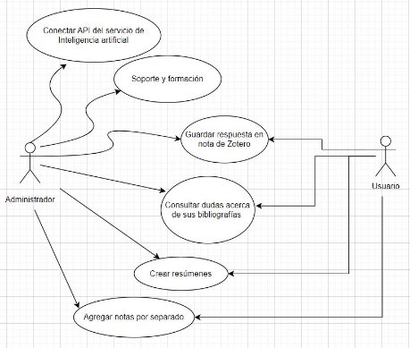

3) Escenarios de caso de uso(narrativa)

<table><tr><th colspan="1" valign="top"><b>Caso de Uso</b></th><th colspan="2" valign="top">Conectar API del servicio de Inteligencia artificial</th><th colspan="1" valign="top"><b>CU01</b></th></tr>
<tr><td colspan="1"><b>Actores</b></td><td colspan="3">Administrador</td></tr>
<tr><td colspan="1" valign="top"><b>Descripción</b></td><td colspan="3" valign="top">Establecer la conexión entre el proyecto de zotero con el servicio de inteligencia artificial por medio de peticiones.</td></tr>
<tr><td colspan="1"><b>Precondicion es</b></td><td colspan="3" valign="top">Tener perfil de administrador</td></tr>
<tr><td colspan="1" rowspan="4"><b>FLUJO NORMAL</b></td><td colspan="3"><b>ACCIÓN: Conectar</b></td></tr>
<tr><td colspan="1"><b>ACCIÓN DEL ACTOR</b></td><td colspan="2"><b>CURSO DEL SISTEMA</b></td></tr>
<tr><td colspan="1" valign="top">1\. El administrador ingresa al sistema por medio de su cuenta de zotero.</td><td colspan="2" valign="top">
2\. El sistema mostrará la ventana principal de Zotero con un menú en la parte superior con la siguientes opciones:

- Archivo

- Editar

- Ver

- Herramientas

- Ayuda
</td></tr>
<tr><td colspan="1" valign="top">3\. El usuario deberá de hacer click donde dice “<i>Herramientas”</i>.</td><td colspan="2" valign="top">
4\. El sistema mostrará las siguientes opciones:

- Crear una cronografía

- Escaneo RTF

- Instalar conector de navegador

- Complementos

- Desarrollador

- Gestionar adjuntos
</td></tr>
</table>

<table><tr><th colspan="1" rowspan="2"></th><th colspan="1"></th><th colspan="1"></th></tr>
<tr><td colspan="1" valign="top">5\. El usuario deberá dar click en “<i>Complementos”</i></td><td colspan="1" valign="top">6\. El sistema abrirá una ventana donde el usuario podrá ver las extensiones activas con zotero.</td></tr>
<tr><td colspan="1"></td><td colspan="1" valign="top">7\. Dar click en el ícono de engrane que se encuentra en la parte superior derecha de la ventana nueva</td><td colspan="1" valign="top">
8\. El usuario podrá ver diferentes opciones como:

- Check for Updates

- View Recent Updates

- Install Add-on From File...

- Debug Add-ons

- Update Add-ons Automatically

- Reset All Add-ons to Update Automatically
</td></tr>
<tr><td colspan="1"></td><td colspan="1" valign="top">9\. Dar click on “<i>Install Add-on From File…”</i></td><td colspan="1" valign="top">10\. Se abrirá una nueva venta de archivos para que el usuario seleccione el paquete del proyecto para tener el complemento de IA.</td></tr>
</table>

<table><tr><th colspan="1" valign="top"><b>Caso de Uso</b></th><th colspan="2" valign="top">Soporte y formación</th><th colspan="1" valign="top"><b>CU02</b></th></tr>
<tr><td colspan="1" valign="top"><b>Actores</b></td><td colspan="3" valign="top">Administrador</td></tr>
<tr><td colspan="1" valign="top"><b>Descripción</b></td><td colspan="3" valign="top">El administrador podrá dejar forma de contacto así como manuales y preguntas frecuentes en la sección de ayuda.</td></tr>
<tr><td colspan="1"><b>Precondicion es</b></td><td colspan="3" valign="top">Haber iniciado sesión en el sistema</td></tr>
<tr><td colspan="1" rowspan="3"><b>FLUJO NORMAL</b></td><td colspan="3" valign="top"><b>ACCIÓN: Brindar soporte</b></td></tr>
<tr><td colspan="1" valign="top"><b>ACCIÓN DEL ACTOR</b></td><td colspan="2" valign="top"><b>CURSO DEL SISTEMA</b></td></tr>
<tr><td colspan="1" valign="top">1\. El usuario ingresa al sistema y selecciona la opción de ayuda en la parte superior.</td><td colspan="2">
2\. El sistema mostrará un listado con opciones disponibles para este usuario:

- Soporte y documentación (H)

- Información sobre resolución de problemas (1)

- Foros de discusión

- Informa de errores...
</td></tr>
</table>

<table><tr><th colspan="1" rowspan="2"></th><th colspan="1"></th><th colspan="1" valign="top">
- Registro de salida de depuración

- Comprobar actualizaciones...

- Acerca de Zotero
</th></tr>
<tr><td colspan="1" valign="top">3\. El administrador deberá seleccionar la opción de soporte y documentación.</td><td colspan="1">4\. El sistema abrirá una ventana de archivos para que el usuario seleccione los manuales que desea agregar a la documentación del sistema.</td></tr>
</table>

<table><tr><th colspan="1"><b>Caso de Uso</b></th><th colspan="2">Consultar dudas acerca de sus bibliografías</th><th colspan="1"><b>CU03</b></th></tr>
<tr><td colspan="1"><b>Actores</b></td><td colspan="3">Administrador y contador</td></tr>
<tr><td colspan="1" valign="top"><b>Descripción</b></td><td colspan="3" valign="top">El usuario podrá realizar preguntas específicas al asistente para que este le conteste en base al documento elegido</td></tr>
<tr><td colspan="1" valign="top"><b>Precondiciones</b></td><td colspan="3" valign="top">-</td></tr>
<tr><td colspan="1" rowspan="5" valign="top"><b>FLUJO NORMAL</b></td><td colspan="3"><b>ACCIÓN: Consultar</b></td></tr>
<tr><td colspan="1" valign="top"><b>ACCIÓN DEL ACTOR</b></td><td colspan="2" valign="top"><b>CURSO DEL SISTEMA</b></td></tr>
<tr><td colspan="1" valign="top">1\. El usuario ingresa a Zotero de manera normal con su cuenta</td><td colspan="2" valign="top">2\. El sistema muestra su pantalla de inicio con las opciones en la parte superior, en la última podemos observar un ícono de una carita con lentes.</td></tr>
<tr><td colspan="1" valign="top">3\. El usuario le da click sobre el ícono</td><td colspan="2" valign="top">4\. El sistema abre una ventana nueva con una serie de opciones para saber que quiere hacer el usuario.</td></tr>
<tr><td colspan="1" valign="top">5\. El usuario ingresa en la parte inferior la pregunta que desea realizar y pone “<i>/”</i></td><td colspan="2" valign="top">6\. El sistema mostrará las opciones para seleccionar el documento sobre el que el usuario quiere trabajar.</td></tr>
</table>

||||
| :- | :- | :- |
||7\. Selecciona el artículo o archivo de su investigación sobre el que desea hacer la consulta y presiona enter|8\. El sistema hace una petición al servicio del asistente mandando como parámetros la consulta y el archivo sobre el que se van a basar las respuestas.|

<table><tr><th colspan="1" valign="top"><b>Caso de Uso</b></th><th colspan="2" valign="top">Crear resúmenes</th><th colspan="1" valign="top"><b>CU04</b></th></tr>
<tr><td colspan="1"><b>Actores</b></td><td colspan="3">Administrador y usuario</td></tr>
<tr><td colspan="1" valign="top"><b>Descripción</b></td><td colspan="3" valign="top">El usuario podrá realizar resúmenes con ayuda del asistente en base al documento elegido.</td></tr>
<tr><td colspan="1"><b>Precondicion es</b></td><td colspan="3" valign="top">Estar en la ventana del asistente</td></tr>
<tr><td colspan="1" rowspan="5"><b>FLUJO NORMAL</b></td><td colspan="3" valign="top"><b>ACCIÓN: Crear</b></td></tr>
<tr><td colspan="1" valign="top"><b>ACCIÓN DEL ACTOR</b></td><td colspan="2" valign="top"><b>CURSO DEL SISTEMA</b></td></tr>
<tr><td colspan="1" valign="top">1\. El usuario realiza la petición del resúmen en el campo de mensaje poniendo al final “<i>/”</i></td><td colspan="2" valign="top">2\. El sistema mostrará las opciones para seleccionar el documento sobre el que el usuario quiere trabajar.</td></tr>
<tr><td colspan="1" valign="top">3\. Selecciona el artículo o archivo de su investigación sobre el que desea hacer el resumen y presiona enter</td><td colspan="2">4\. El sistema hace una petición al servicio del asistente mandando como parámetros la consulta y el archivo sobre el que se van a basar las respuestas.</td></tr>
<tr><td colspan="1" valign="top">5\. El usuario espera en la misma ventana en lo que el asistente responde.</td><td colspan="2" valign="top">
6. El sistema muestra un breve resumen según el archivo que el usuario seleccionó, así como su debida referencia.

7. Toda la conversación se muestra en forma de chat entre el usuario y el asistente virtual.
</td></tr>
</table>

<table><tr><th colspan="1" valign="top"><b>Caso de Uso</b></th><th colspan="2" valign="top">Guardar respuesta en nota de Zotero</th><th colspan="1" valign="top"><b>CU05</b></th></tr>
<tr><td colspan="1"><b>Actores</b></td><td colspan="3">Administrador y usuario</td></tr>
<tr><td colspan="1" valign="top"><b>Descripción</b></td><td colspan="3" valign="top">Las respuestas que nos brinde el asistente deben venir con una opción para generar una nota propia de Zotero y guardarla en la biblioteca de la investigación.</td></tr>
<tr><td colspan="1" valign="top"><b>Precondicion es</b></td><td colspan="3" valign="top">Estar en la ventana del asistente.</td></tr>
<tr><td colspan="1" rowspan="4" valign="top"><b>FLUJO NORMAL</b></td><td colspan="3" valign="top"><b>ACCIÓN: Guardar</b></td></tr>
<tr><td colspan="1" valign="top"><b>ACCIÓN DEL ACTOR</b></td><td colspan="2" valign="top"><b>CURSO DEL SISTEMA</b></td></tr>
<tr><td colspan="1" valign="top">1\. El usuario pone el mouse sobre la respuesta del asistente.</td><td colspan="2" valign="top">
2\. El sistema mostrará un par de opciones para hacer con la respuesta del mismo:

- Guardar como nota

- Agregar nota por separado
</td></tr>
<tr><td colspan="1" valign="top">3\. El usuario selecciona la opción para guardar la respuesta como nota.</td><td colspan="2" valign="top">4\. El sistema entonces le manda a zotero la información de la respuesta para que este pueda crear una nota dentro del apartado para el archivo sobre el que se está investigando.</td></tr>
</table>

|**Caso de Uso**|Agregar notas por separado|**CU06**|
| - | - | - |
|**Actores**|Administrador y usuario||
|**Descripción**|Los usuarios podrán crear notas y que se guarden dentro del repositorio pero fuera del apartado del artículo.||
|**Precondicion es**|Estar en la ventana del asistente||
|**FLUJO NORMAL**|**ACCIÓN: Agregar**||

<table><tr><th colspan="1" rowspan="3"></th><th colspan="1" valign="top"><b>ACCIÓN DEL ACTOR</b></th><th colspan="1" valign="top"><b>CURSO DEL SISTEMA</b></th></tr>
<tr><td colspan="1" valign="top">1\. El usuario pone el mouse sobre la respuesta del asistente.</td><td colspan="1" valign="top">
2\. El sistema mostrará un par de opciones para hacer con la respuesta del mismo:

- Guardar como nota

- Agregar nota por separado
</td></tr>
<tr><td colspan="1" valign="top">3\. El usuario selecciona la opción <i>“Agregar nota por separado”</i>.</td><td colspan="1" valign="top">4\. El sistema entonces le manda a zotero la información de la respuesta para que este pueda crear una nota dentro del del repositorio pero fuera del apartado de la investigación.</td></tr>
</table>

3) Modelo Lógico
1) Análisis de objetos
1) Diagrama de actividades

*CU01 - Conectar API del servicio de Inteligencia artificial*

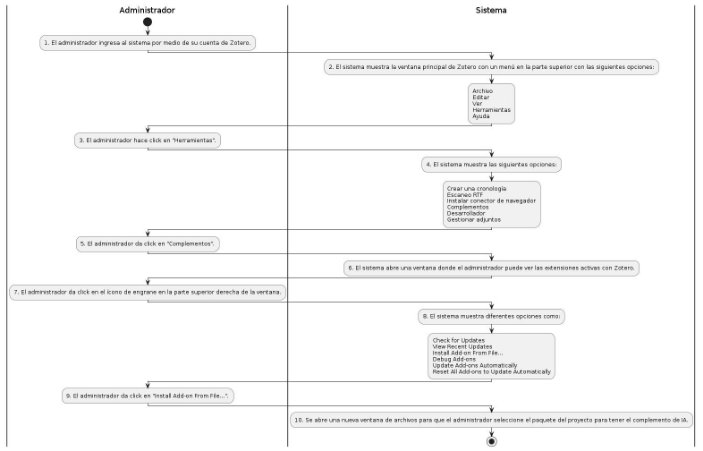

*CU02 - Soporte y formación*

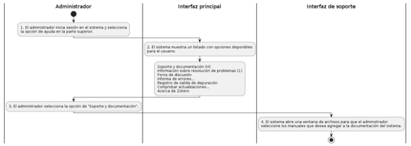

*CU03 - Consultar dudas acerca de sus bibliografías*

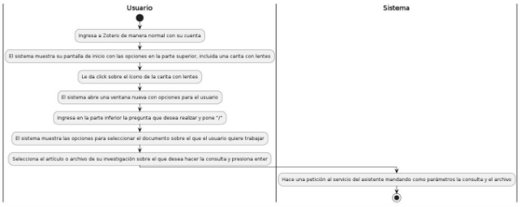

*CU04 - Crear resúmenes*

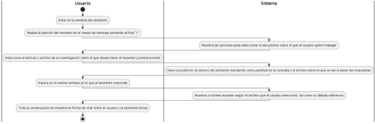

*CU05 - Guardar respuesta en nota de Zotero*

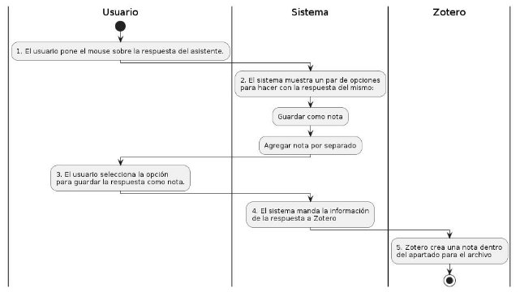

*CU06 - Agregar notas por separado*

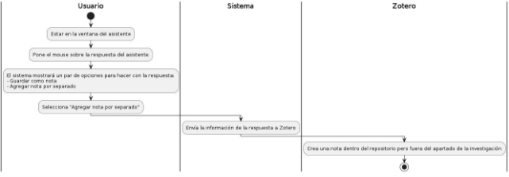

3) Diagrama de secuencia

*CU01 - Conectar API del servicio de Inteligencia artificial*

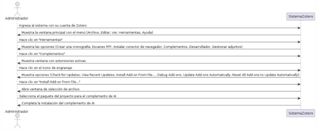

*CU02 - Soporte y formación*

*CU03 - Consultar dudas acerca de sus bibliografías*

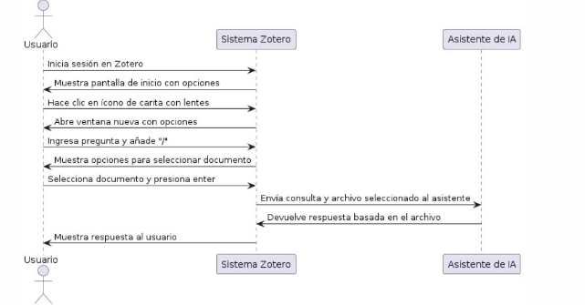

*CU04 - Crear resúmenes*

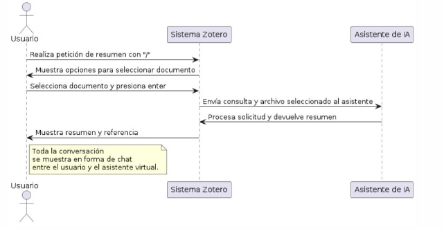

*CU05 - Guardar respuesta en nota de Zotero*

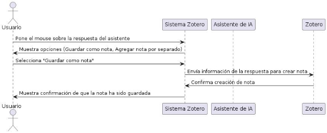

*CU06 - Agregar notas por separado*

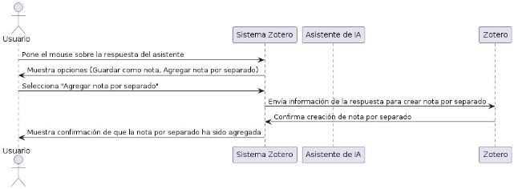

4) Diagrama de clases

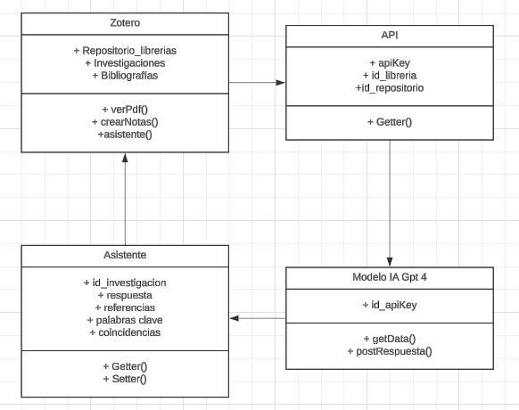

CONCLUSIONES:

Facilidad de Uso y Accesibilidad: La integración de un asistente de inteligencia artificial dentro de Zotero proporciona una interfaz intuitiva y accesible para los usuarios, lo que facilita la realización de tareas complejas como la creación de resúmenes y la consulta de dudas sobre bibliografías. Aumento de la productividad: La capacidad de realizar acciones como crear resúmenes y consultar dudas directamente desde la plataforma de Zotero agiliza el proceso de investigación y aumenta la productividad de los usuarios al proporcionar respuestas rápidas y precisas.

Organización y Gestión Mejoradas: La opción de guardar respuestas como notas dentro del repositorio de Zotero, ya sea como parte del artículo o por separado, mejora la organización y gestión de la información, permitiendo a los usuarios mantener un registro claro y estructurado de sus investigaciones.

Personalización y Adaptabilidad: La posibilidad de seleccionar acciones específicas según las necesidades del usuario, como guardar respuestas como notas o agregarlas por separado, proporciona una experiencia personalizada y adaptable que se ajusta a los diferentes estilos de trabajo y preferencias de los usuarios.

Optimización del Flujo de Trabajo: La integración de un asistente de IA en Zotero optimiza el flujo de trabajo al eliminar la necesidad de alternar entre diferentes herramientas y plataformas para realizar tareas relacionadas con la investigación, lo que simplifica y agiliza el proceso en general.

Feedback y Mejora Continua: Recopilar comentarios de los usuarios sobre la funcionalidad del asistente de IA en Zotero permitirá realizar mejoras continuas en el sistema, asegurando que satisfaga las necesidades y expectativas de los usuarios a lo largo del tiempo.

RECOMENDACIONES

UpSystem Solutions no se encarga del manejo de cuentas o soporte directo del software de open source de Zotero por lo que es responsabilidad de cada usuario tener una cuenta zotero activa y administrar según sus necesidades.

Considerar los tamaños de los complementos que desea implementar según las características de sus equipos antes de descargar cualquier complemento.

WEBGRAFÍA https://www.plantuml.com/plantuml/uml/SyfFKj2rKt3CoKnELR1Io4ZDoSa70000
